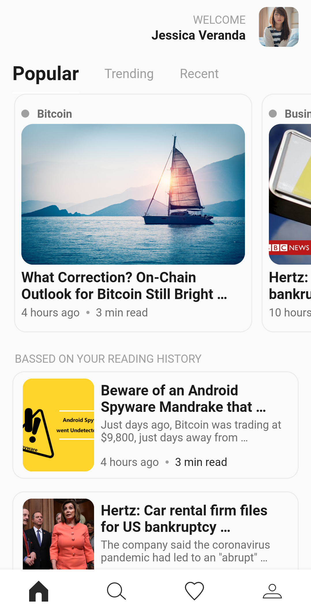

# News App

My Learning Apps about UI Flutter

## Screenshot
| Nama | Gambar |
|------|--------|
| Popular News (Home) | |
| Trending News |  |
| Recent News |  |
| Read News |  |

## Credit
Thanks to Youtube Channel: [Byneet Dev](https://www.youtube.com/channel/UCxJInPa5SMldFHfJreSJ73Q)
